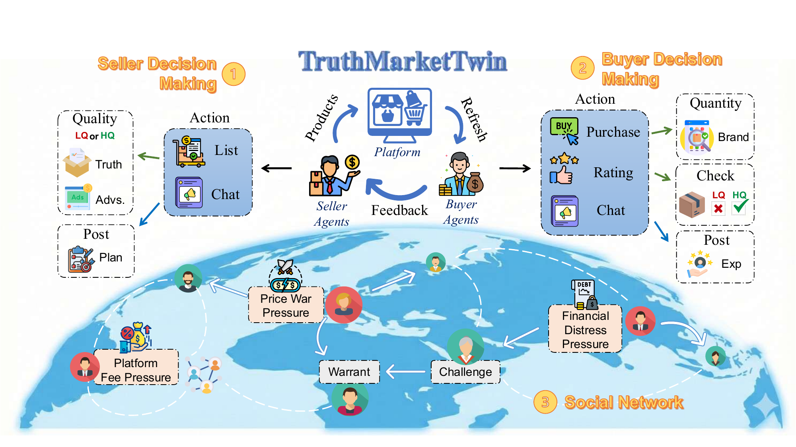

# OASIS Truth Market Simulation

A multi-agent online market simulation system built on the [OASIS](https://github.com/camel-ai/oasis) framework, designed to study agent behavior patterns in realistic market environments, with a particular focus on information asymmetry, reputation mechanisms, and warranty systems' impact on market efficiency.



## Overview

This project implements a multi-agent online market simulation environment featuring:

- **Seller Agents**: Can list high or low quality products, choose whether to offer warranties
- **Buyer Agents**: Make purchasing decisions based on seller reputation and product information
- **Market Mechanisms**: Include reputation systems, warranty institutions, and transaction tracking

## Quick Start

### 1. Prerequisites

- Python 3.10+ (< 3.12)
- An LLM API Key (OpenAI or vLLM-compatible)

### 2. Install OASIS Framework

```bash
pip install camel-oasis
```

### 3. Install Project Dependencies

```bash
pip install -r requirements.txt
```

### 4. Environment Configuration

Copy the template and configure your API key:

```bash
cp .env.template .env
```

Edit `.env`:

```text
MODEL_API_KEY=your_api_key_here
MODEL_BASE_URL=https://api.openai.com/v1
```

| Variable        | Description                      | Required |
|-----------------|----------------------------------|----------|
| `MODEL_API_KEY` | API key for the model provider   | Yes      |
| `MODEL_BASE_URL` | Base URL for API endpoint       | Optional |

## Run Simulation

### Using Experiment Scripts

```bash
# Run the full experiment pipeline
./scripts/run_exp4paper_main.sh

# Override config and model via environment variables
CONFIG_FILE=configs/sim_gpt4o_10s_10b_10r_runs5_base.yaml \
MODEL_TYPE=gpt-4o \
./scripts/run_exp4paper_main.sh
```

Individual per-RQ scripts are also available:

- `./scripts/run_rq1_intent.sh`
- `./scripts/run_rq2_welfare.sh`
- `./scripts/run_rq3_resilience.sh`

### Using Python Entry Points

Direct Python runners are in `example/`:

```bash
# Intent probe experiment
python ./example/run_intent_probe_experiment.py \
    --market-type reputation_only \
    --output-dir experiments/my_run/rq1_intent \
    --config configs/sim_gpt4omini_5s_5b_10r_runs5_base.yaml

# Market condition batch experiment
python ./example/run_market_condition_experiment.py \
    --experiment-id my_run/rq2_welfare \
    --market-type reputation_and_warrant \
    --communication none \
    --communication-channel-type Fake \
    --config configs/sim_gpt4omini_5s_5b_10r_runs5_base.yaml \
    --disable-reentry
```

### Simulation Parameters

Parameters are configured via YAML files in `configs/`. Key adjustable parameters:

- **Market type**: `reputation_only` or `reputation_and_warrant`
- **Communication**: `none` / `seller` / `buyer` / `both`; channel `Real` or `Fake`
- **Economic parameters**: production costs, prices, consumer utilities, budgets
- **Market rules**: reputation lag, re-entry rounds, exit rounds
- **Model settings**: platform (`openai` / `vllm`), model type

Command-line flags override YAML values, which override `config.py` defaults.

### Customize Agent Characteristics

Modify prompt templates in `prompt.py`:

- `SELLER_GENERATION_SYS_PROMPT` / `SELLER_GENERATION_USER_PROMPT`: System and user prompts for seller agent generation
- `BUYER_GENERATION_SYS_PROMPT` / `BUYER_GENERATION_USER_PROMPT`: System and user prompts for buyer agent generation
- `SELLER_ROUND_PROMPT`: Dynamic prompt for sellers during each round
- `BUYER_ROUND_PROMPT`: Dynamic prompt for buyers during each round

## Related Resources

- [OASIS Official Documentation](https://docs.oasis.camel-ai.org/)
- [OASIS GitHub Repository](https://github.com/camel-ai/oasis)
- [CAMEL-AI Project](https://github.com/camel-ai/camel)

## License

This project is licensed under the Apache License 2.0.

## Acknowledgments

Thanks to the [OASIS](https://github.com/camel-ai/oasis) project for providing an excellent multi-agent simulation framework, and to the [CAMEL-AI](https://github.com/camel-ai/camel) team for their important contributions in the AI agent field.
